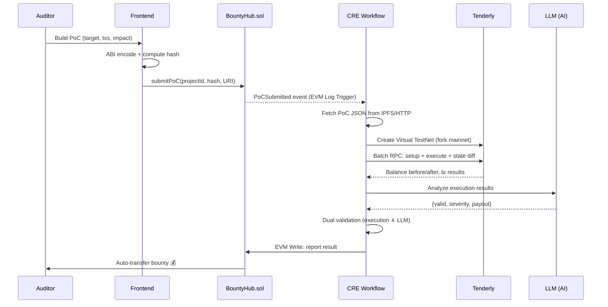

# AntiSoon

> **No more "soon". Verify now. Get paid now.**

Decentralized vulnerability verification powered by **Chainlink CRE** + **Tenderly Virtual TestNets** + **AI Analysis**. Submit a PoC, get it verified by decentralized nodes, receive bounty instantly.

AntiSoon replaces the slow, opaque process of centralized audit platforms with a trustless, automated pipeline. The name is a rebellion against the "soon" culture — where auditors wait weeks for reviews, months for payouts, and forever for fairness.

## Architecture

```
┌─────────────────────────────────────────────────────────────────┐
│                         AntiSoon Platform                       │
│                                                                 │
│  ┌──────────┐     ┌────────────────────────────────────────┐    │
│  │  Auditor  │────▶│  BountyHub.sol (Sepolia)               │    │
│  │ (PoC Builder) │  │  registerProject() / submitPoC()       │    │
│  └──────────┘     │  emit PoCSubmitted(...)                  │    │
│                    └──────────────┬───────────────────────┘    │
│                                   │ EVM Log Trigger            │
│                    ┌──────────────▼───────────────────────┐    │
│                    │  CRE Workflow: verify-poc             │    │
│                    │                                       │    │
│                    │  HTTP 1 → Fetch PoC from IPFS/HTTP    │    │
│                    │  HTTP 2 → Tenderly: Create Fork       │    │
│                    │  HTTP 3 → Tenderly: Execute PoC       │    │
│                    │  HTTP 4 → LLM: Analyze Results        │    │
│                    │  BFT Consensus across DON nodes       │    │
│                    │  EVM Write → Result + Auto-Payout     │    │
│                    └──────────────────────────────────────┘    │
│                                                                 │
│  ┌──────────────────────────────────────────────────────────┐  │
│  │  Tenderly Virtual TestNet                                 │  │
│  │  Fork mainnet → Set preconditions → Execute attack        │  │
│  │  → Compare pre/post state → Return diff                   │  │
│  └──────────────────────────────────────────────────────────┘  │
└─────────────────────────────────────────────────────────────────┘
```

## How It Works



## Tech Stack

| Layer | Technology | Purpose |
|-------|-----------|---------|
| Smart Contracts | Solidity + Foundry | BountyHub: registration, submission, escrow, auto-payout |
| CRE Workflow | TypeScript + @chainlink/cre-sdk | Verification orchestrator: event → simulate → analyze → settle |
| Simulation | Tenderly Virtual TestNets | On-demand mainnet fork for PoC execution |
| AI Analysis | OpenRouter (configurable model) | Severity classification + report generation |
| PoC Storage | IPFS / HTTP | Off-chain PoC data, on-chain hash anchor |
| Frontend | React + Vite + viem | PoC Builder UI with wallet integration |
| Network | Ethereum Sepolia | Testnet deployment |

## Project Structure

```
anti-soon/
├── contracts/                     # Solidity (Foundry)
│   ├── src/
│   │   ├── BountyHub.sol          # Core: registration, submission, auto-payout
│   │   ├── ReceiverTemplate.sol   # Chainlink CRE receiver base
│   │   └── IReceiver.sol          # Interface
│   ├── test/BountyHub.t.sol       # 15 tests, all passing
│   ├── script/Deploy.s.sol        # Sepolia deployment
│   └── foundry.toml
├── workflow/                      # CRE Workflow
│   └── verify-poc/
│       ├── main.ts                # Full pipeline: IPFS → Tenderly → LLM → EVM Write
│       ├── config.staging.json    # Network + API configuration
│       └── workflow.yaml
├── frontend/                      # PoC Builder UI
│   └── src/
│       ├── components/
│       │   ├── Hero.tsx           # Landing section
│       │   ├── PoCBuilder.tsx     # Multi-step PoC construction wizard
│       │   └── HowItWorks.tsx     # Architecture visualization
│       ├── hooks/useWallet.ts     # viem wallet integration
│       └── config.ts              # Contract ABI + addresses
├── project.yaml                   # CRE project config
├── secrets.yaml                   # Secret declarations
└── .env.example                   # Environment template
```

## Deployed Contracts

| Contract | Network | Address |
|----------|---------|---------|
| BountyHub | Sepolia | [`0x82c85B0A96633A887D9fD7Fb575fA2339fDb7582`](https://sepolia.etherscan.io/address/0x82c85B0A96633A887D9fD7Fb575fA2339fDb7582) |

## CRE Workflow Design

The verification pipeline operates within CRE's **5 HTTP request budget**:

| # | Target | Purpose |
|---|--------|---------|
| 1 | IPFS/HTTP | Fetch full PoC JSON, verify hash integrity |
| 2 | Tenderly REST API | Create Virtual TestNet (fork from mainnet at specified block) |
| 3 | Tenderly Admin RPC | **JSON-RPC batch**: setup preconditions + execute attack + capture state diff |
| 4 | LLM API | Analyze execution results, classify severity, suggest payout |
| — | EVM Write (built-in) | Write verification result on-chain → auto-payout if valid |

**Dual Validation**: Both execution results (measurable state change) AND LLM analysis must agree. This prevents:
- False positives from benign state changes (execution passes but LLM rejects)
- LLM hallucinations (LLM approves but execution shows no impact)

**BFT Consensus**: All DON nodes independently execute the same verification pipeline. `consensusIdenticalAggregation` ensures tamper-proof results.

## Anti-Abuse Mechanisms

| Mechanism | Implementation | Effect |
|-----------|---------------|--------|
| Gas cost | On-chain submission | Economic barrier against bots |
| Cooldown | 10 min per auditor per project | Prevent spam |
| PoC dedup | `pocHash → bool` mapping | Reject duplicate submissions |
| CRE auth | Only KeystoneForwarder can write results | Prevent forged verdicts |
| Dual validation | Execution ∧ LLM | Prevent false payouts |

## Quick Start

### Prerequisites

- [Foundry](https://book.getfoundry.sh/getting-started/installation)
- [Node.js](https://nodejs.org/) v18+
- [CRE CLI](https://docs.chain.link/cre/getting-started/installation)
- [Bun](https://bun.sh/) (or npm)

### Setup

```bash
# Clone
git clone https://github.com/LSHFGJ/anti-soon.git
cd anti-soon

# Configure secrets
cp .env.example .env
# Edit .env with your keys:
#   CRE_ETH_PRIVATE_KEY=0x...
#   TENDERLY_API_KEY_VALUE=...
#   LLM_API_KEY_VALUE=...

# Install workflow dependencies
cd workflow/verify-poc && npm install && cd ../..

# Install frontend dependencies
cd frontend && npm install && cd ..

# Build contracts
cd contracts && forge build && cd ..
```

### Run Tests

```bash
cd contracts && forge test -v
# 15/15 tests passing
```

### Run CRE Simulation

```bash
# Submit a PoC on-chain first (see docs/), then:
cre workflow simulate workflow/verify-poc \
  --target staging-settings \
  --non-interactive \
  --trigger-index 0 \
  --evm-tx-hash <YOUR_SUBMIT_TX_HASH> \
  --evm-event-index 0
```

### Run Frontend

```bash
cd frontend && npm run dev
# Open http://localhost:5173
```

## Demo Scenario

AntiSoon is demonstrated using a real audit competition case from [Cantina's Silo V2 audit](https://cantina.xyz/competitions/18f1e37b-9ac2-4ba9-b32e-50344500c1a7) ($250K prize pool, 247 findings submitted). The demo replays a known vulnerability through AntiSoon's automated pipeline:

1. **Project registers** on BountyHub with a bounty pool
2. **Auditor submits** a structured PoC targeting the vulnerability
3. **CRE Workflow** triggers: forks mainnet via Tenderly → executes PoC → LLM analyzes
4. **Bounty auto-paid** to auditor upon successful verification

Full cycle completes in **< 10 seconds** — compared to weeks on traditional platforms.

## Track Alignment

| Track | How AntiSoon Fits |
|-------|-------------------|
| **Risk & Compliance** | Real-time vulnerability response system with automated protocol security triggers |
| **CRE & AI** | AI-in-the-loop verification with multi-node BFT consensus preventing hallucination |
| **Tenderly Virtual TestNets** | CRE orchestrates Tenderly sandbox for zero-trust exploit verification via fork + batch simulation |

## The Problem: "Soon"

Centralized audit platforms suffer from:

- **Slow cycles**: Weeks to review, months to pay. Auditors hear "soon" endlessly.
- **Unfair competition**: Ranking systems, bots, and insider advantages.
- **Opaque verification**: No way to verify how findings are judged.
- **Single point of failure**: One platform, one team, one decision.

AntiSoon eliminates all of these with decentralized, automated, instant verification and payout.

## License

MIT
