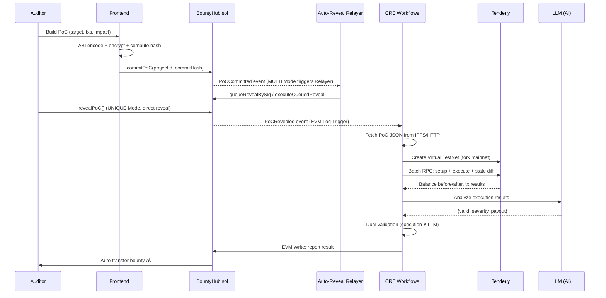

# AntiSoon

> **No more "soon". Verify now. Get paid now.**

Decentralized vulnerability verification powered by **Chainlink CRE** + **Tenderly Virtual TestNets** + **AI Analysis**. Submit a PoC, get it verified by decentralized nodes, receive bounty instantly.

AntiSoon replaces the slow, opaque process of centralized audit platforms with a trustless, automated pipeline. The name is a rebellion against the "soon" culture — where auditors wait weeks for reviews, months for payouts, and forever for fairness.

## Architecture

```
┌─────────────────────────────────────────────────────────────────┐
│                         AntiSoon Platform                       │
│                                                                 │
│  ┌──────────┐     ┌────────────────────────────────────────┐    │
│  │  Auditor  │────▶│  BountyHub.sol (Sepolia)               │    │
│  │ (PoC Builder) │  │  registerProject() / commitPoC()       │    │
│  └──────────┘     │  emit PoCCommitted(...)                  │    │
│                    │  revealPoC()                             │    │
│                    │  emit PoCRevealed(...)                   │    │
│                    └──────────────┬───────────────────────┘    │
│                                   │ EVM Log Trigger            │
│                    ┌──────────────▼───────────────────────┐    │
│                    │  CRE Workflow: verify-poc             │    │
│                    │                                       │    │
│                    │  HTTP 1 → Fetch PoC from IPFS/HTTP    │    │
│                    │  HTTP 2 → Tenderly: Create Fork       │    │
│                    │  HTTP 3 → Tenderly: Execute PoC       │    │
│                    │  HTTP 4 → LLM: Analyze Results        │    │
│                    │  BFT Consensus across DON nodes       │    │
│                    │  EVM Write → Result + Auto-Payout     │    │
│                    └──────────────────────────────────────┘    │
│                                                                 │
│  ┌──────────────────────────────────────────────────────────┐  │
│  │  Tenderly Virtual TestNet                                 │  │
│  │  Fork mainnet → Set preconditions → Execute attack        │  │
│  │  → Compare pre/post state → Return diff                   │  │
│  └──────────────────────────────────────────────────────────┘  │
└─────────────────────────────────────────────────────────────────┘
```

## How It Works



## Tech Stack

| Layer | Technology | Purpose |
|-------|-----------|---------|
| Smart Contracts | Solidity + Foundry | BountyHub: registration, commit/reveal, escrow, auto-payout |
| CRE Workflow | TypeScript + @chainlink/cre-sdk | Verification orchestrator: event → simulate → analyze → settle |
| Simulation | Tenderly Virtual TestNets | On-demand mainnet fork for PoC execution |
| AI Analysis | OpenRouter (configurable model) | Severity classification + report generation |
| PoC Storage | IPFS / HTTP | Off-chain PoC data, on-chain hash anchor |
| Frontend | React + Vite + viem | PoC Builder UI with wallet integration |
| Network | Ethereum Sepolia | Testnet deployment |

## Project Structure

```
anti-soon/
├── contracts/                     # Solidity (Foundry)
│   ├── src/
│   │   ├── BountyHub.sol          # Core: registration, commit/reveal, auto-payout
│   │   ├── ReceiverTemplate.sol   # Chainlink CRE receiver base
│   │   └── IReceiver.sol          # Interface
│   ├── test/BountyHub.t.sol       # 15 tests, all passing
│   ├── script/Deploy.s.sol        # Sepolia deployment
│   └── foundry.toml
├── workflow/                      # CRE Workflows
│   ├── verify-poc/                # Full pipeline triggered by PoCRevealed
│   │   ├── main.ts                # Full pipeline: IPFS → Tenderly → LLM → EVM Write
│   │   ├── config.staging.json    # Network + API configuration
│   │   └── workflow.yaml
│   ├── vnet-init/                 # Tenderly VNet orchestration
│   ├── auto-reveal-relayer/       # Delayed reveal orchestration triggered by PoCCommitted
│   └── jury-orchestrator/         # Dispute and adjudication orchestration
├── frontend/                      # PoC Builder UI
│   └── src/
│       ├── components/
│       │   ├── Hero.tsx           # Landing section
│       │   ├── PoCBuilder.tsx     # Multi-step PoC construction wizard
│       │   └── HowItWorks.tsx     # Architecture visualization
│       ├── hooks/useWallet.ts     # viem wallet integration
│       └── config.ts              # Contract ABI + addresses
├── project.yaml                   # CRE project config
├── secrets.yaml                   # Secret declarations
└── .env.example                   # Environment template
```

## Deployed Contracts

| Contract | Network | Address |
|----------|---------|---------|
| BountyHub | Sepolia | [`0x82c85B0A96633A887D9fD7Fb575fA2339fDb7582`](https://sepolia.etherscan.io/address/0x82c85B0A96633A887D9fD7Fb575fA2339fDb7582) |

## CRE Workflow Design

The verification pipeline operates within CRE's **5 HTTP request budget**:

| # | Target | Purpose |
|---|--------|---------|
| 1 | IPFS/HTTP | Fetch full PoC JSON, verify hash integrity |
| 2 | Tenderly REST API | Create Virtual TestNet (fork from mainnet at specified block) |
| 3 | Tenderly Admin RPC | **JSON-RPC batch**: setup preconditions + execute attack + capture state diff |
| 4 | LLM API | Analyze execution results, classify severity, suggest payout |
| — | EVM Write (built-in) | Write verification result on-chain → auto-payout if valid |

**Dual Validation**: Both execution results (measurable state change) AND LLM analysis must agree. This prevents:
- False positives from benign state changes (execution passes but LLM rejects)
- LLM hallucinations (LLM approves but execution shows no impact)

**BFT Consensus**: All DON nodes independently execute the same verification pipeline. `consensusIdenticalAggregation` ensures tamper-proof results.

## Anti-Abuse Mechanisms

| Mechanism | Implementation | Effect |
|-----------|---------------|--------|
| Gas cost | On-chain commits | Economic barrier against bots |
| Cooldown | 10 min per auditor per project | Prevent spam |
| PoC dedup | `pocHash → bool` mapping | Reject duplicate commits |
| CRE auth | Only KeystoneForwarder can write results | Prevent forged verdicts |
| Dual validation | Execution ∧ LLM | Prevent false payouts |

## Quick Start

### Prerequisites

- [Foundry](https://book.getfoundry.sh/getting-started/installation)
- [Node.js](https://nodejs.org/) v18+
- [CRE CLI](https://docs.chain.link/cre/getting-started/installation)
- [Bun](https://bun.sh/)

### Setup

```bash
# Clone
git clone https://github.com/LSHFGJ/anti-soon.git
cd anti-soon

# Configure secrets
cp .env.example .env
# Edit .env with your keys:
#   CRE_ETH_PRIVATE_KEY=0x...
#   TENDERLY_API_KEY_VALUE=...
#   LLM_API_KEY_VALUE=...

# Install workflow dependencies
cd workflow/verify-poc && bun install && cd ../..

# Install frontend dependencies
cd frontend && bun install && cd ..

# Install and build contracts (dependencies are managed by Foundry, not committed)
cd contracts && forge install foundry-rs/forge-std OpenZeppelin/openzeppelin-contracts && forge build && cd ..
```

### Run Tests

```bash
cd contracts && forge test -v
# 15/15 tests passing
```

### Run CRE Simulation

```bash
# Commit and reveal a PoC on-chain first (see docs/), then:
cre workflow simulate workflow/verify-poc \
  --target staging-settings \
  --non-interactive \
  --trigger-index 0 \
  --evm-tx-hash <YOUR_REVEAL_TX_HASH> \
  --evm-event-index 0
```

### Run Frontend

```bash
cd frontend && bun run dev
# Open http://localhost:5173
```

## Auto Reveal Queue (MULTI mode)

`BountyHub` now supports delayed reveal custody for relayer execution:

- Auditor signs reveal authorization and submits `queueRevealBySig(...)`
- Relayer executes `executeQueuedReveal(...)` after commit deadline
- Existing `PoCRevealed` event continues to trigger `workflow/verify-poc`

### Required environment

Set these values in `.env` for local/ops environments:

```bash
VITE_ENABLE_AUTO_REVEAL_QUEUE=false
AUTO_REVEAL_RPC_URL=https://ethereum-sepolia-rpc.publicnode.com
AUTO_REVEAL_PRIVATE_KEY=0x...
AUTO_REVEAL_BOUNTY_HUB_ADDRESS=0x8b12D6F28453be1eEf2D5ff151df3a2eE68d7f97
AUTO_REVEAL_CHAIN_ID=11155111
AUTO_REVEAL_LOOKBACK_BLOCKS=5000
AUTO_REVEAL_REPLAY_OVERLAP_BLOCKS=12
AUTO_REVEAL_LOG_CHUNK_BLOCKS=5000
AUTO_REVEAL_CURSOR_FILE=workflow/auto-reveal-relayer/.auto-reveal-cursor.json
```

- `VITE_ENABLE_AUTO_REVEAL_QUEUE=true` enables frontend queueing for `MULTI` projects
- Keep relayer private key in secret manager (never in client bundle)
- `AUTO_REVEAL_CURSOR_FILE` persists scan progress across restarts; keep this path on durable storage

### Relayer setup and trigger

```bash
cd workflow/auto-reveal-relayer
bun install
bun run run-once
```

Run `run-once` on a schedule (cron/systemd/CI) to process queued reveals.

### Rollout steps

1. Deploy updated contract and update `frontend/src/config.ts` address/ABI to match.
2. Enable queueing only in staging (`VITE_ENABLE_AUTO_REVEAL_QUEUE=true`).
3. Run relayer on a 1-2 minute schedule and verify queued reveals execute after commit deadline.
4. Confirm `PoCRevealed` events trigger `workflow/verify-poc` as expected.
5. Promote to production and monitor stuck queue count + expired signature count.

## Demo Scenario: Sequence Wallet

**Demo Project**: [Sequence](https://github.com/code-423n4/2025-10-sequence) - Modular crypto infrastructure stack for account abstraction (ERC-4337)

**Audit Details**: Code4rena Oct 2025 | $73,000 USDC | 297 H/M findings | 561 submissions

### Vulnerabilities Demonstrated

| ID | Severity | Title | PoC |
|----|----------|-------|-----|
| H-01 | High | Chained signature bypasses checkpointer validation | `pocs/H-01-checkpointer-bypass.t.sol` |
| H-02 | High | Partial signature replay attack on session calls | `pocs/H-02-partial-replay-attack.t.sol` |

### Demo Flow

```
┌─────────────────────────────────────────────────────────────────┐
│  1. Register: Sequence project → BountyHub.sol                 │
│     └─ Bounty: 73,000 USDC escrow                               │
│                                                                 │
│  2. Commit & Reveal: Auditor commits then reveals PoC for H-01  │
│     └─ pocURI: ipfs://QmXxx... (JSON payload)                  │
│     └─ pocHash: 0xabc123... (integrity check)                  │
│                                                                 │
│  3. Verify: CRE Workflow triggers automatically                │
│     ├─ HTTP 1: Fetch PoC from IPFS                              │
│     ├─ HTTP 2: Tenderly fork mainnet @ block 21M               │
│     ├─ HTTP 3: Execute attack (setBalance + eth_sendTx)        │
│     ├─ HTTP 4: LLM analyzes: "Valid High severity exploit"     │
│     └─ Consensus: All DON nodes agree                          │
│                                                                 │
│  4. Payout: $27,086.77 USDC → auditor wallet                   │
│     └─ Time: < 10 seconds total                                │
└─────────────────────────────────────────────────────────────────┘
```

### Run the Demo

```bash
# 1. Build the Sequence project
cd demo-projects/sequence && forge build && cd ../..

# 2. Verify PoC locally
./demo-projects/sequence/verify-poc.sh H-01

# 3. Submit to AntiSoon (requires Sepolia ETH)
# See frontend/ for PoC Builder UI
```

### Compare: AntiSoon vs Traditional

| Step | Traditional Platform | AntiSoon |
|------|---------------------|----------|
| Submit PoC | Submit → Wait for review | Submit → Instant trigger |
| Verification | Manual by judges (weeks) | Automated via CRE (seconds) |
| Payout | Manual processing (months) | Smart contract instant |
| Transparency | Opaque decision process | On-chain verifiable results |

## Track Alignment

| Track | How AntiSoon Fits |
|-------|-------------------|
| **Risk & Compliance** | Real-time vulnerability response system with automated protocol security triggers |
| **CRE & AI** | AI-in-the-loop verification with multi-node BFT consensus preventing hallucination |
| **Tenderly Virtual TestNets** | CRE orchestrates Tenderly sandbox for zero-trust exploit verification via fork + batch simulation |

## The Problem: "Soon"

Centralized audit platforms suffer from:

- **Slow cycles**: Weeks to review, months to pay. Auditors hear "soon" endlessly.
- **Unfair competition**: Ranking systems, bots, and insider advantages.
- **Opaque verification**: No way to verify how findings are judged.
- **Single point of failure**: One platform, one team, one decision.

AntiSoon eliminates all of these with decentralized, automated, instant verification and payout.

## License

MIT
